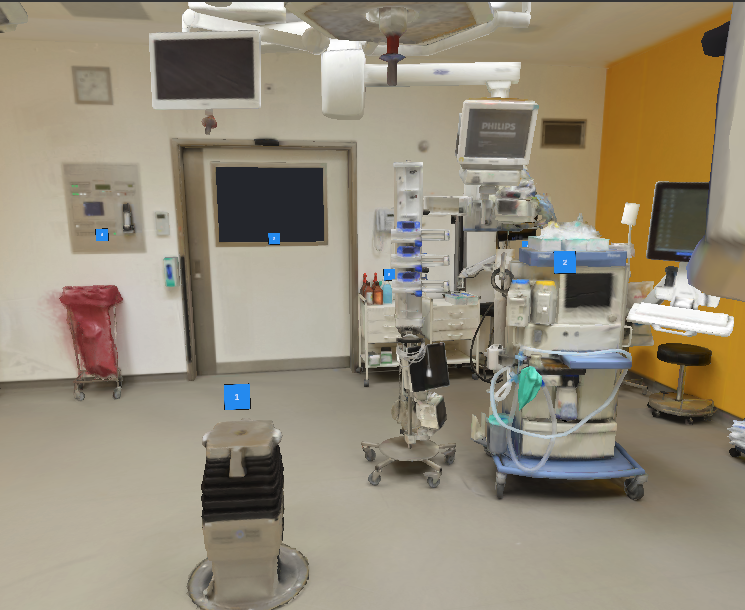
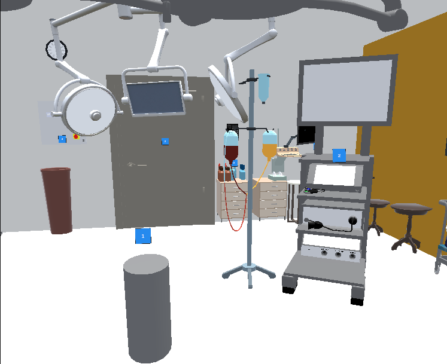

# Realism in Virtual Operating Rooms – Collaborative VR Training Prototype

A multiplayer VR prototype for surgical training, built for my bachelor's thesis
*"Investigating the Realism of Virtual Environments for Surgical Tasks"*
(German title: *Untersuchung des Realismus virtueller Umgebungen für operative Aufgaben*),
Human-Computer Interaction group, Technische Universität Berlin, 2025.

The prototype was used in a user study to examine how the **visual realism** of a virtual
operating room affects task performance, spatial orientation and sense of presence.

<table> <tr> <th>Volumetric room</th> <th>Simplified room</th> </tr> <tr> <td></td> <td></td> </tr> </table>

---

## Overview

A trainee and a trainer meet in the same virtual operating room on two Meta Quest 3 headsets.
The trainee completes three tasks while the trainer observes, gives hints and can reveal the solution.

The application contains **two versions of the same operating room**:

| Volumetric room | Simplified room |
| --- | --- |
| Photogrammetric 3D scan of a real operating room at Charité – Universitätsmedizin Berlin | Stylized rebuild of the same room from primitives and free 3D models, without textures, shadows or small details |

Layout, interactions, instruments and tasks are identical in both rooms; only the visual realism differs.

### Training tasks

1. **Instrument setup** – place and orient surgical instruments on a table according to a memorized template
2. **Tray transport** – carry a tray through the room to a target position while avoiding obstacles
3. **Object naming** – name numbered devices in the room (e.g. anesthesia tower, room control panel)

---

## Features

- **Grabbing and placing surgical instruments** with the XR Interaction Toolkit, including colliders for small, complex geometries
- **Two-person multiplayer** (host/client) with synchronized avatars and voice chat
- **Role-based visibility:** a solution tablet and info panels that only the trainer can see, plus a trainer-only button that reveals the solution to the trainee
- **Numbered objects** with trainer-only descriptions for giving targeted hints
- **Start scene** to choose between the volumetric and the simplified room, and a return button that works without an active network connection

## My contributions

The project is built on Unity's **VR Multiplayer Template**, which provides the networking setup,
avatars, voice chat and basic interactables. My own work includes:

- Integrating the volumetric operating room scan into Unity (instrument tables, colliders, trainer UI, solution tablet)
- Building the simplified comparison room, including improvised models for devices that were not freely available
- Role-based visibility of objects via Netcode for GameObjects (`ServerRpc`)
- Ownership handling for grabbed objects so that both users can interact with them
- Start scene, room selection and return navigation
- Configuring the surgical instruments as networked interactables

## Tech stack

- **Unity 6** (6000.0.40f1), **C#**
- **XR Interaction Toolkit**, OpenXR
- **Netcode for GameObjects**, Unity Gaming Services (via the template)
- **Meta Quest 3**
- Testing: ParrelSync (parallel editor instances), XR Device Simulator
- Study analysis: Python (pandas, matplotlib, seaborn)

---

## Getting started

### Requirements

- Unity **6000.0.40f1** with Android build support
- Two Meta Quest 3 headsets, or ParrelSync / XR Device Simulator for local testing
- A Unity Cloud project linked to the Unity project (required for the multiplayer services)

### Running the project

1. Clone the repository and open it in Unity Hub with the version above.
2. Link the project to your Unity Cloud project (*Edit → Project Settings → Services*).
3. Open the start scene and press Play, or build for Android and deploy to the headset.
4. **The trainee has to join first as host**, then the trainer joins as client
   (this follows from how the template synchronizes interactions).

---

## User study (summary)

- **Design:** between-subjects, n = 18 students without operating room experience, 9 per condition
- **Measures:** task performance (time, score, hints, corrections), observed navigation behaviour,
  and presence via the Igroup Presence Questionnaire (IPQ)

**Key findings**

- The **simplified room** led to slightly better results in instrument setup and navigation.
- The **volumetric room** led to better results in naming and recognizing objects.
- **Presence** scores were similar in both conditions; inconsistent realism levels
  (abstract avatars and UI in a photorealistic room) may have reduced perceived realism.

The results suggest a concept of **functional realism**: the level of visual detail should be
chosen according to the task instead of maximizing realism by default.

---

## Known issues

- Placing small instruments with complex geometry occasionally behaves unexpectedly.
- In rare cases, instrument positions differ slightly between host and client.
- Switching scenes while connected can require a restart, as disconnecting is not fully reliable.

---

## Credits and licenses

The 3D models of the operating room, the surgical tables and the surgical instruments were created by
the Digital Surgery group of Experimental Surgery, Charité – Universitätsmedizin Berlin.
More about their research: [experimental-surgery.de/digitalsurgery](http://experimental-surgery.de/digitalsurgery/)

### Volumetric operating room

*Charité University Hospital – Operating Room*: photogrammetric reconstruction of a general operating room
at Charité Campus Mitte, scanned in 2018.
[View on Sketchfab](https://sketchfab.com/3d-models/charite-university-hospital-operating-room-fa63aa330e1048a7ab7e63a54845c6c3)

Citation:
> Queisner M, Pogorzhelskiy M, Remde C, Pratschke J, Sauer IM. VolumetricOR: A New Approach to Simulate
> Surgical Interventions in Virtual Reality for Training and Education. Surg Innov. 2022 Jun;29(3):406-415.
> doi: 10.1177/15533506211054240. Epub 2022 Feb 9. PMID: 35137646; PMCID: PMC9438748.

### Surgical tables

Photogrammetric reconstruction of surgical instrument tables.
[View on Sketchfab](https://sketchfab.com/3d-models/surgical-instrument-table-collection-a1fcfeab1ad646638089655e8b6f0e2b)
> Christopher Remde, Moritz Queisner, 2024, Experimental Surgery, Charité Universitätsmedizin Berlin

### Surgical instruments

Collection of commonly used surgical instruments, modelled by
[NMY Mixed-Reality Communication GmbH](https://www.nmy.de/en).
[View on Sketchfab](https://sketchfab.com/3d-models/surgical-instruments-collection-46f5799ca36240efae3abec6e61d4c8a)
> Christopher Remde, Moritz Queisner, 2024, Experimental Surgery, Charité Universitätsmedizin Berlin & NMY Mixed-Reality Communication GmbH

### Models used in the simplified room

| Asset | Source |
| --- | --- |
| IV Pole | [CGTrader](https://www.cgtrader.com/free-3d-models/science/medical/iv-pole-45630c1e-d231-4e1f-adf0-2ff8fa0633ec) |
| Control Switch | [CGTrader](https://www.cgtrader.com/free-3d-models/industrial/industrial-part/control-switch) |
| Low-Poly Table Cloth | [CGTrader](https://www.cgtrader.com/free-3d-models/interior/living-room/low-poly-table-cloth) |
| Lowpoly Medical Room | [Fab](https://www.fab.com/listings/57ac0dc7) |
| Telephone | [Fab](https://www.fab.com/listings/0789a2e9-a293-4afb-a814-0a1ba2a962e5) |
| Soap Bottle | [CGTrader](https://www.cgtrader.com/items/3586565/download-page) |
| Tissue Box | [CGTrader](https://www.cgtrader.com/free-3d-models/interior/living-room/tissue-box-9441c671-fe49-4e5d-9134-894c573d6b6f) |
| Spray Bottle | [CGTrader](https://www.cgtrader.com/free-3d-models/household/kitchenware/spray-bottle-ebfe9439-5c7c-4d0f-9096-8417c8c300a8) |
| Door White – Freepoly.org | [Fab](https://www.fab.com/listings/dc703bd8-3aa8-4c10-8442-610ea0af0b6a) |
| Realistic Medical Equipment and Accessories Set | [Fab](https://www.fab.com/listings/c91a1c90-205e-466b-8e6e-27177c90ba44) |
| Small Metal Trolley | [CGTrader](https://www.cgtrader.com/free-3d-models/industrial/tool/small-metal-trolley) |
| Air Washer | CGTrader |
| Adjustable Shower Hose | [CGTrader](https://www.cgtrader.com/free-3d-models/furniture/other/adjustable-shower-hose-free-colapsed-samples) |
| Detailed Closet with Clothes and Boxes | [CGTrader](https://www.cgtrader.com/items/205475/download-page) |
| Surgery Lamp | [CGTrader](https://www.cgtrader.com/free-3d-models/science/medical/surgery-lamp) |
| CC0 – Tray | [CGTrader](https://www.cgtrader.com/free-3d-models/household/kitchenware/cc0-tray) |

Some furniture prefabs come from the Unity Learn pathway [VR Basics](https://learn.unity.com/tutorial/vr-project-setup).
All third-party models remain under the licenses of their respective authors.

### Template

Based on the [Unity VR Multiplayer Template](https://docs.unity3d.com/Packages/com.unity.template.vr-multiplayer@latest)
by Unity Technologies. Interaction setup partly follows Unity's
[VR Multiplayer Template tutorial series](https://www.youtube.com/playlist?list=PLX2vGYjWbI0RvG_RfZo7_u_i36G-YuILI).

---

## Author

**Thekla Mayer** – Bachelor's thesis in Computer Science, Technische Universität Berlin (2025)
Supervised by Prof. Dr. Ceenu George, second reviewer Prof. Dr. Moritz Queisner
